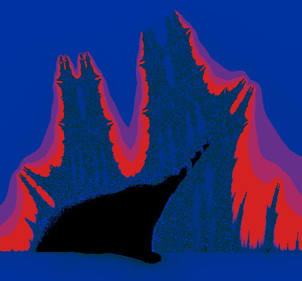

<main>
<figure style="float:right">
  
<figcaption>
  On the <a href="https://en.wikipedia.org/wiki/Burning_Ship_fractal" target="_blank">burning ship</a> we sail the <a href="http://math.stanford.edu/~vakil/216blog/FOAGnov1817public.pdf" target="_blank">rising seas</a>.
</figcaption>
</figure>

# Rindra Razafy

## Master's student

### About me.

I am a graduate student, under the supervision of [Adam Topaz](https://adamtopaz.com). 
My research interests lie in Algebraic Geometry, Category Theory and Combinatorics.

I was previously at the University of Waterloo where I completed my
BMATH in Pure Mathematics, and joint Combinatorics and Optimization.

I also work on formalization of mathematics in Lean and visualising
maths with Rust. You can find more of this work on my
[github: razafy-rindra](https://github.com/razafy-rindra){target="_blank"}.

### Publications

[David McKinnon, Rindra Razafy, Matthew Satriano, and Yuxuan Sun. On curves with high multiplicity on P(a,b,c) for min(a,b,c) ≤ 4. New York Journal of Mathematics, (2021), 1060-1084](https://nyjm.albany.edu/j/2021/27-41.html)

### Notes

Assortement of notes I've typed up. These notes still need to be edited
to fix the typos, please email me if you find some.

-   [Algebraic Geometry, from Borcherds first course on youtube](./Borcherds_Algebraic_Geometry_1.pdf){target="_blank"}
-   [Hodge Theory, from Winter 2024 course at University of Alberta (work in progress)](./Hodge_Notes.pdf){target="_blank"}

> "Living is a thing you do now or never - which do you?"
-Piet Hein

</main>
