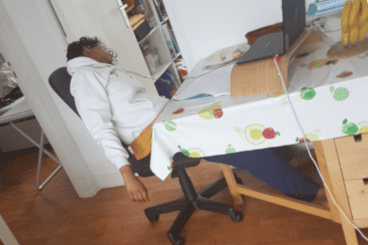

<!-- rgba(123, 103, 140, 0.8)-->

<main>

<input type="checkbox" class="toggler" />

<ul>
<li><a href="#profile">⇨ Profile</a></li>
<li><a href="#rindra">Rindra</a></li>
<li><a href="#nirina">Nirina</a></li>
<li><a href="#lerina">Lerina</a></li>
<li><a href="./html/socraz/raz.html">The Holding</a></li>
</ul>

<section class="go_up">

</section>
<section>
<blockquote>
"Needs are few, yet wants are many."
<footer><i>- Way of the Ancestors</i></footer>
</blockquote>
</section>

<section>
<header>
# <a href="./index.html#profile">&#8680; Profile</a> {.collapse}

<h2 id="profile">Profile</h2>

And Contact Information

</header>
</section>
<section>
<aside>
<h3>Rindra Razafy</h3>

- <small>Pure Math Scholar ...</small>
: [resume](./resume/Razafy_Rindra_CV (2).pdf){target="_blank"}   [ualberta directory](https://apps.ualberta.ca/directory/person/razafy){target="_blank"} 
</aside>
<aside>
<h3>Nirina Razafy</h3>

- <small>Recharging before Action</small>
: [resume](./resume/#){target="_blank"}  
</aside>
<aside>
<h3>Lerina Razafy</h3>

- <small>The proof is in the Code</small>
: [resume](./resume/#){target="_blank"} 
</aside>
</section>

[Top](#TOC)

</main>
# Rindra {.left_header_pad}

{style="width:100%; object-fit: cover;"}

<main>

[Top](#TOC)

</main>
# Nirina {.left_header_pad}

{style="width:100%; object-fit: cover;"}

<main>

[Top](#TOC)

</main>
# Lerina {.left_header_pad}

{style="width:100%; object-fit: cover;"}

<main>

[Top](#TOC)

</main>
<footer class="center_justify">
  <a href="https://github.com/lerina" target="_blank" title="github">{.link .glow}
  </a>  [Rust dev website](https://lerina.github.io)
</footer>

