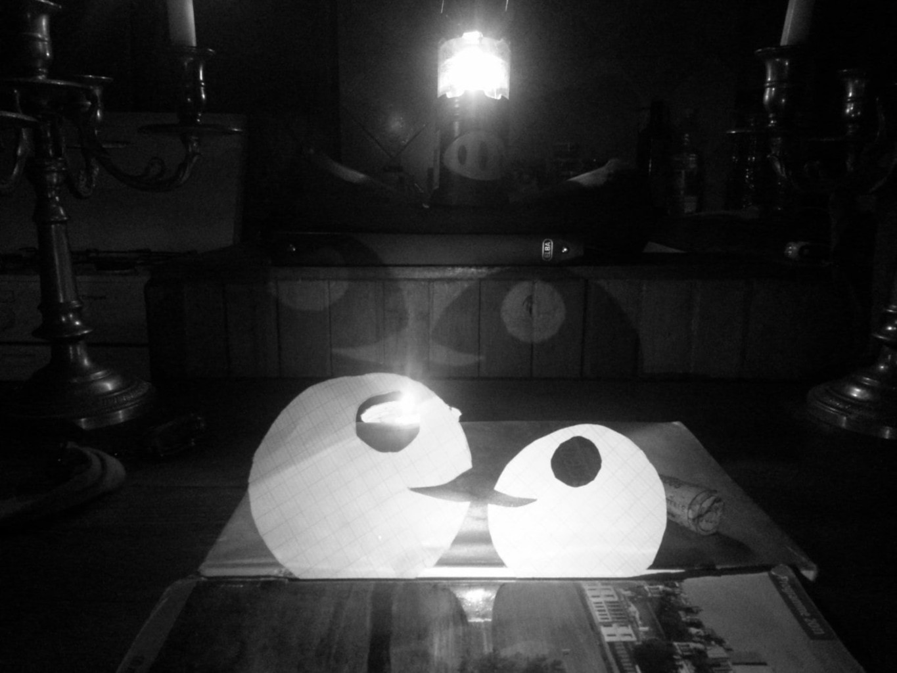

<!--
style>:root{--color-bg: linear-gradient(45deg, rgba(255,228,113, 0.9),rgba(228,105,41,0.7));}</style
-->

<header>
        <h1>Page Heading with <i>Italics</i> and <u>Underline</u> not in the TOC</h1>
        <p>Page Subheading with <mark>highlighting</mark></p>
        <br>
        <p><a href="#"><i>Italic Link Button</i></a> centered in header <a href="#"><b>Bold Link Button &rarr;</b></a></p>
</header>
<main>

# <a href="./index.html">⇦ home</a> {.collapse}

# Wasm demo in beta stage

## wasm-bindgen, web-sys & Html Canvas

| Demo   | Description                 |
|:------:|-----------------------------|
| [Invaders](./invaders/index.html)    | invader with a twist | 
| | |


<div class="alt-pre">

```
Run the mouse 
     over here         
```
```
This is 
     the Alternate text
```

</div>  


<hr>
<section id="section-1">
<header>
<h2>Section Heading</h2>
<p>Section Subheading</p>
</header>
<aside>
<h3>Rindra Razafy</h3>
<p>

</p>
<p><small>Pure Math Scholar</small></p>
</aside>
<aside>
<h3>Nirina Razafy</h3>
<p>

</p>
<p><small>Recharging before Action</small></p>
</aside>
<aside>
<h3>Lerina Razafy</h3>
<p>

</p>
<p><small>The proof is in the Code</small></p>
</aside>
</section>
<hr>
<section>
<blockquote>
"Quote"
<footer><i>- Attribution</i></footer>
</blockquote>
</section>
<hr>
<section>
<table>
<thead>
<tr>
    <th></th>
    <th>Col A</th>
    <th>Col B</th>
    <th>Col C</th>
</tr>
</thead>
<tr>
<td>Row 1</td>
<td>Cell A1</td>
<td>Cell B1</td>
<td>Cell C1</td>
</tr>
<tr>
<td>Row 2</td>
<td>Cell A2</td>
<td>Cell B2</td>
<td>Cell C2</td>
</tr>
</table>
</section>
<hr>
<article>
<h2>Left-aligned header</h2>
<p>Left-aligned paragraph</p>
<aside>
<p>Article callout</p>
</aside>
<ul>
<li>List item 1</li>
<li>List item 2</li>
</ul>
<!--
<figure>

<figcaption><i>Image caption</i></figcaption>
</figure>
-->
</main>

{style="width:100%;height:40rem;"}

<main>
</article>
<hr>
<div>
<details>
<summary>Expandable title</summary>
<p>Revealed content</p>
</details>
<details>
<summary>Another expandable title</summary>
<p>More revealed content</p>
</details>
<br>
<p>Inline <code>code</code> snippets</p>
<pre>
<code>
// preformatted code block
</code>
</pre>
</div>
<hr>

[Top](#TOC)

</main>
<footer>
  <a href="https://github.com/lerina" target="_blank" title="github">{.link .glow}
  </a> <https://lerina.github.io>
</footer>

